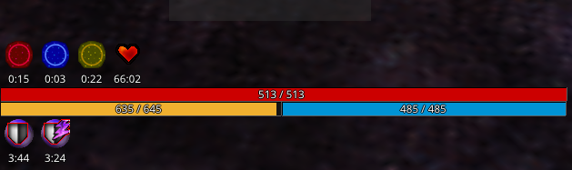
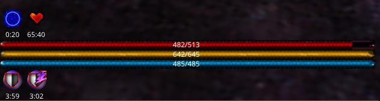
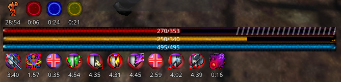
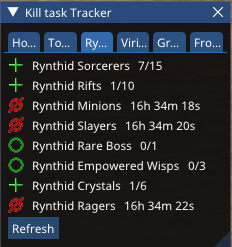
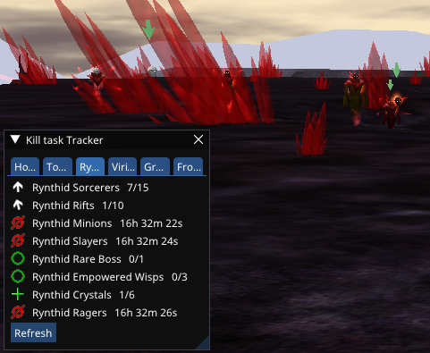
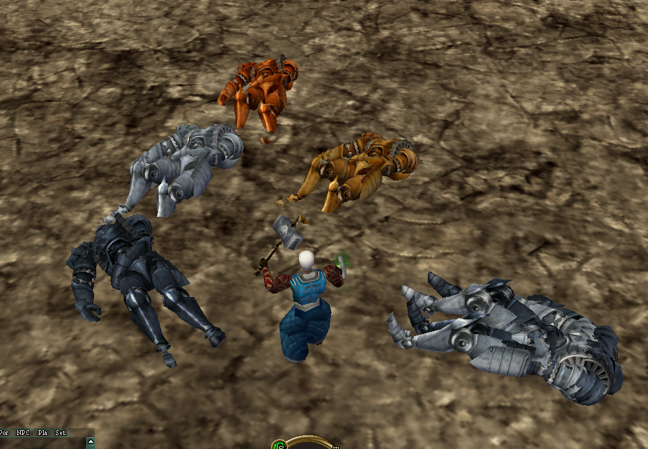
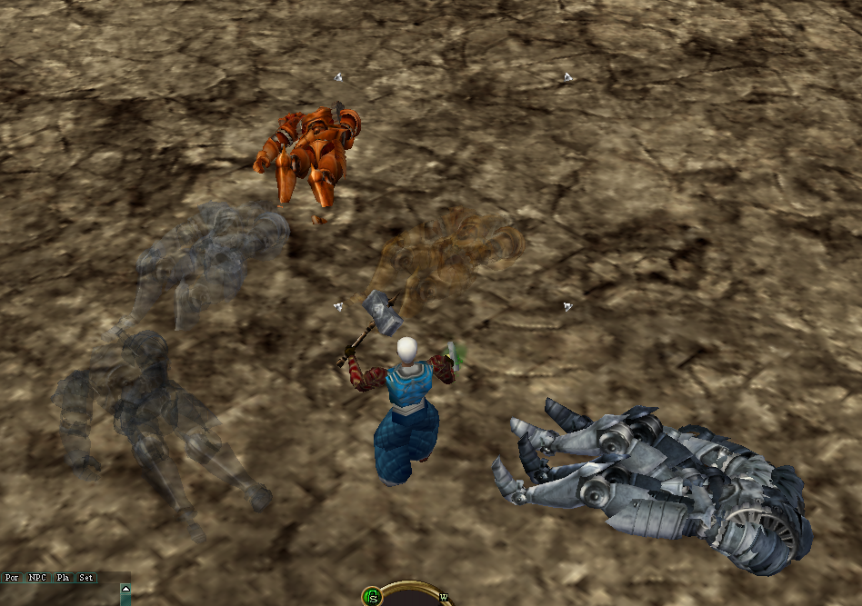

# Aunberean

An [Asheron's Call](https://emulator.ac/how-to-play/) [Decal](https://decaldev.com/) plugin.

Aunberean is a replacement for the AC vitals bar, a kills task tracker, and a few other miscellaneous things.

This plugin is a work in progress. The quest tracking was tested on ACE and the [Levistras](https://acportalstorm.com/) server.

Written by Aun.

## To install

[Decal](https://decaldev.com/) 2.9.8.3 required.

Download the latest installer:  [Download Aunberean](https://github.com/aunrela/Aunberean/releases/download/V0.0.1.0/AunbereanInstaller-0.0.1.exe)

Download this updated beta UtilityBelt: [UtilityBelt](https://gitlab.com/utilitybelt/utilitybelt.gitlab.io/-/package_files/278865008/download)

To upgrade from a previous version, just download and re-run the .exe file.

## Vital Bar

Shows select buffs above the health bar and all debuffs bellow. 

Shows when max hp/stamina/mana has been reduced with a hashed out portion.

Hold control to move and resize.

Aetheria icons:
 - Red = Destruction
 - Blue = Protection
 - Yellow = Regen

## Kill Task Tracker

Currently tracks:
- Hoshino
- Tou-Tou
- Rynthid
- Viridian Rise
- Graveyard
- Frozen Valley

Points to closest mob and marks mobs needed with a green arrow.

Clicking on the mob name selects the closest mob if the task is in progress, or selects the NPC if the quest is ready for turn in or not started.

## Corpse Transparency 

Makes corpses that have been opened slightly transparent. Level of transparency settable all the way to invisible

## Options

This plugin is made using [UtilityBelt.Service](https://gitlab.com/utilitybelt/utilitybelt.service) 

Click the O for the options and K for the kill task tracker.

## Chat Filters

Filters for cloak and aetheria procs are available in the options menu.

## Huge Thanks to

Advis of [Oracle Of Dereth](https://github.com/advis61/OracleOfDereth) 

Utility Belt [UtilityBelt](https://gitlab.com/utilitybelt/utilitybelt) 

Most of the quest tracking code comes from these projects.