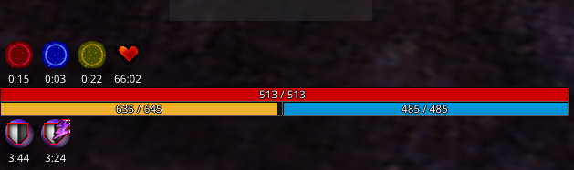
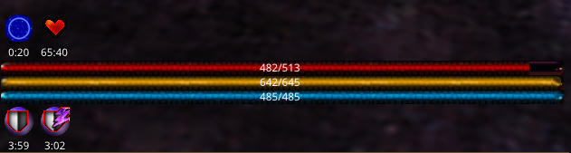
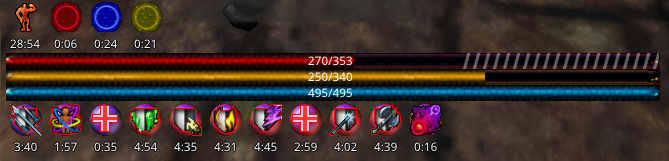
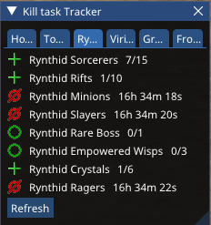
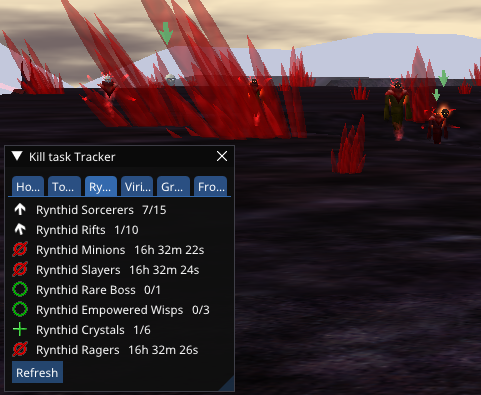
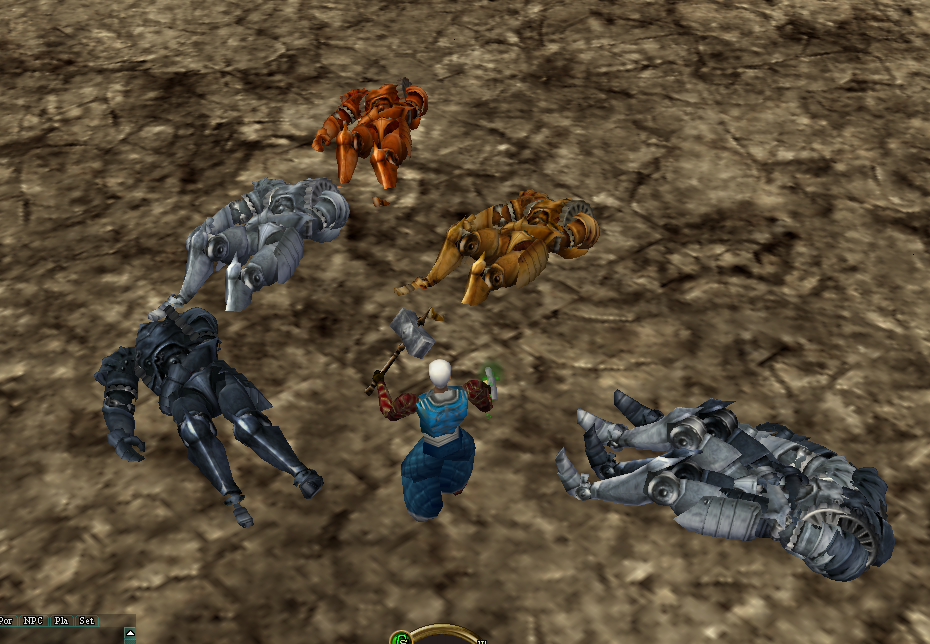
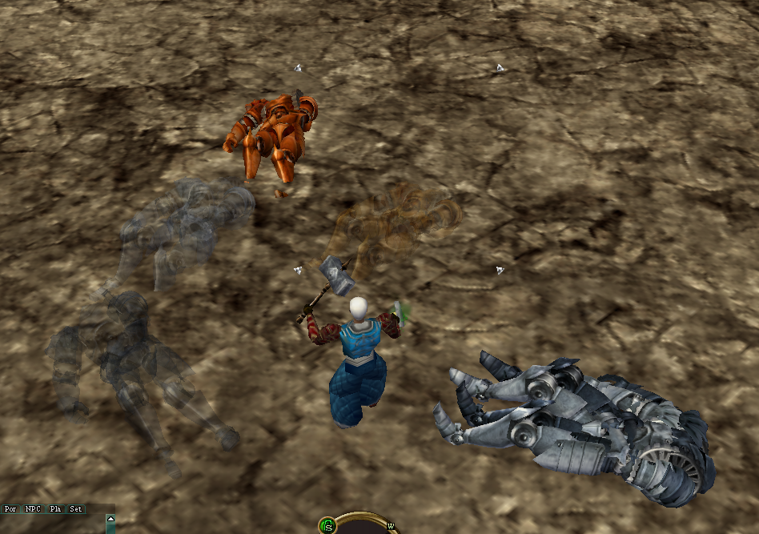
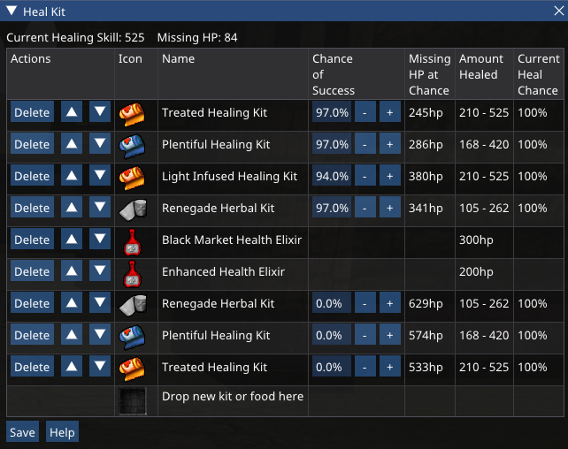
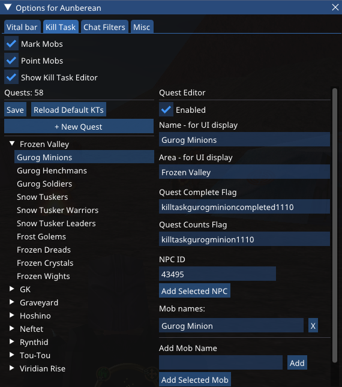

# Aunberean

An [Asheron's Call](https://emulator.ac/how-to-play/) [Decal](https://decaldev.com/) plugin.

Aunberean is a replacement for the AC vitals bar, a kills task tracker, and a few other miscellaneous things.

This plugin is a work in progress. The quest tracking was tested on ACE and the [Levistras](https://acportalstorm.com/) server.

Written by Aun.

## To install

[Decal](https://decaldev.com/) 2.9.8.3 required.

Download the latest installer:  [Download Aunberean](https://github.com/aunrela/Aunberean/releases/download/V0.0.5.0/AunbereanInstaller-0.0.5.exe)

Download this updated beta UtilityBelt: [UtilityBelt](https://gitlab.com/utilitybelt/utilitybelt.gitlab.io/-/package_files/278865008/download)

To upgrade from a previous version, just download and re-run the .exe file.

If you accidentaly click DisableAllRendering in the UtilityBelt Service menu, delete the settings file at 
C:\Games\DecalPlugins\UtilityBelt.Service\settings\ubservice.settings.json

## Vital Bar

Shows select buffs above the health bar and all debuffs bellow. 

Shows when max hp/stamina/mana has been reduced with a hashed out portion.

Hold control to move and resize.

Aetheria icons:
 - Red = Destruction
 - Blue = Protection
 - Yellow = Regen

## Kill Task Tracker

Currently tracks:
- Hoshino
- Tou-Tou
- Rynthid
- Viridian Rise
- Graveyard
- Frozen Valley

Points to closest mob and marks mobs needed with a green arrow.

Clicking on the mob name selects the closest mob if the task is in progress, or selects the NPC if the quest is ready for turn in or not started.

## Cursor Replacements

Replaces the games cursors with white versions.

## Corpse Transparency 

Makes corpses that have been opened slightly transparent. Level of transparency settable all the way to invisible

## Heal Kit -  New in Version 0.0.5

Bind a hotkey in Virindi Hotkey System

When the hotkey is pressed this will check from the top of the list down. Each heal kits chance of success is calculated based on your missing HP and healing skill. If that calculated chance is higher than the setting in the "Chance of Success" column that heal kit will be used on yourself. If it isn't higher it will continue down the list. If it gets to a food or potion item it will check if its off cool-down and use it or skip it.

You should keep at least one kit at the bottom of the list set to 0% chance of success so it will always try to use it if it gets to the bottom.

Missing HP at Chance - Is the amount of hp missing that would calculate as the current chance of success.

Amount Healed - Is the amount that kit can heal for based on your current skill.

Current Heal Chance - Is your chance of success right now with each kit.

## Chat Filters

Filters for cloak and aetheria procs are available in the options menu.

## Options

This plugin is made using [UtilityBelt.Service](https://gitlab.com/utilitybelt/utilitybelt.service) 

Click the O for the options and K for the kill task tracker.

### New in Version 0.0.4

Editor to add and remove kill tasks.

## Huge Thanks to

Advis of [Oracle Of Dereth](https://github.com/advis61/OracleOfDereth) 

Utility Belt [UtilityBelt](https://gitlab.com/utilitybelt/utilitybelt) 

Most of the quest tracking code comes from these projects.